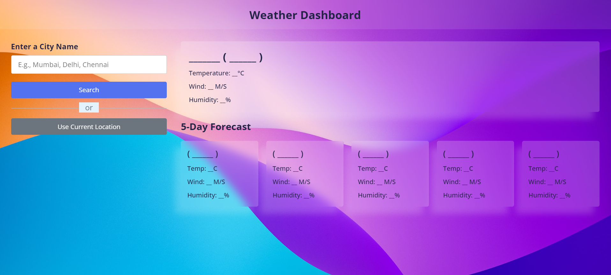

# Weather-Dashboard

This is a weather dashboard that provides users with current weather conditions and forecasts for a specified location. It utilizes HTML, CSS, and JavaScript to create an interactive and visually appealing user interface. The dashboard fetches data from a weather API (OpenWeatherMap API in this example) to provide real-time weather information.

# Demo

